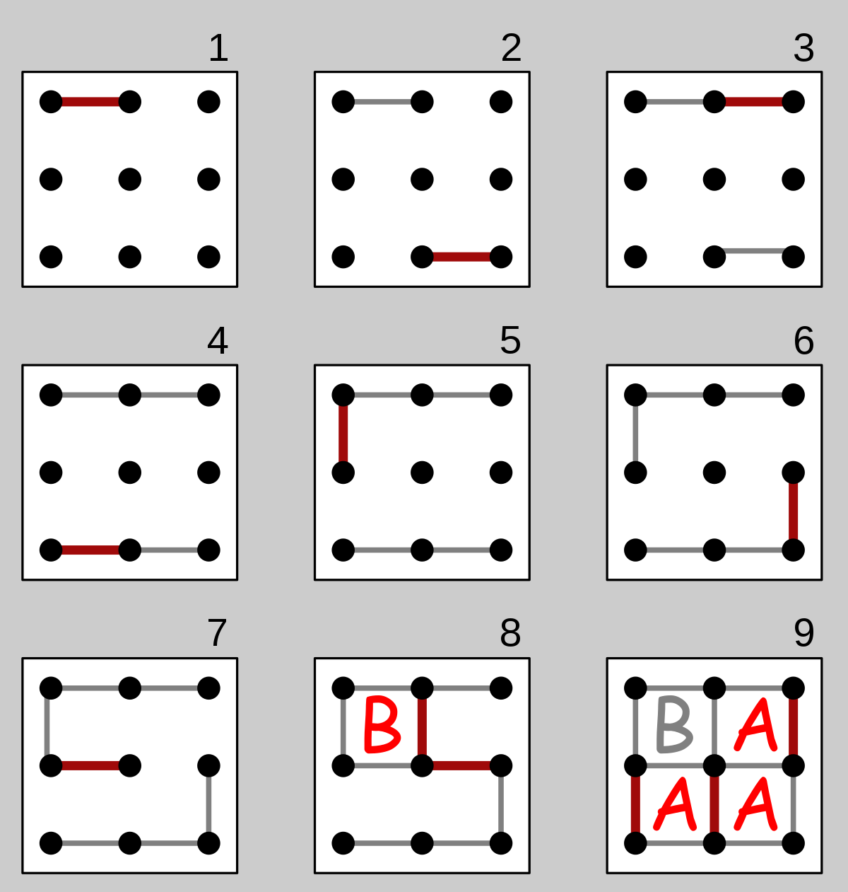

# Dot and Boxes (Player and Computer)

1. It is simple game.
2. See the below image you'll get the idea !

3. The player who completes the first maximum box will be the WINNER !🏆
## Documentation

[Documentation](https://en.wikipedia.org/wiki/Dots_and_Boxes)

  
## Features

- You can play solo with computer as opponent
- Live Score Board
- Able to play on mobile/laptop

## [Live project link](https://sumitvajarinkar.github.io/dotAndBoxes_Game/)
